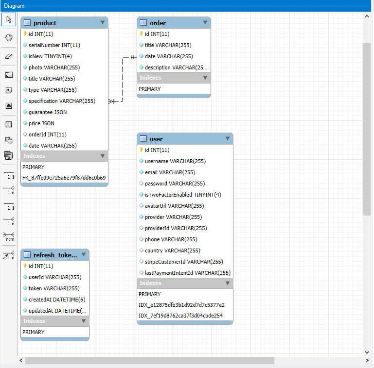

# MyApp

Краткое описание проекта: MyApp — это веб-приложение для управления продуктами и заказами. Позволяет пользователям регистрироваться, авторизоваться, просматривать  товары, редактировать заказы.  

---

## Функционал

- Регистрация и авторизация пользователей как локально (email), так и через OAuth 2.0 (Google)
- Управление профилем пользователя
- CRUD операции с продуктами (просмотр)
- Управление заказами (редактирование заказов)
- Темная/светлая тема интерфейса
- Фильтрация продуктов
- Тестовые данные с сидами для удобного запуска
- Рассчет активных вкладок при помощи socket-io

---

## Используемые технологии на бэкенде

- Node.js + TypeScript — основная платформа и язык.
- Nest.js — основной фреймворк для бэкенда.
- TypeORM — ORM для работы с базой данных.
- MySQL — реляционная база данных.
- Redis (кэш и сессии)
- JWT (passport-jwt + @nestjs/jwt) — авторизация через токены.
- Passport (passport-local, passport-jwt) — аутентификация локально и через токены.
- OAuth (Google) — внешняя аутентификация.
- Nodemailer — отправка email.
- Socket.IO + @nestjs/platform-socket.io — веб-сокеты, реальное время.
- Nest.js Throttler + Scheduler — rate limiting и планировщик задач.
- Docker для контейнеризации

---

## Используемые технологии на фронтенде

- Next.js (App Router v15+)
- React 18, TypeScript
- MUI (Material UI) для интерфейса
- Tailwind CSS для инлайн стилей
- axios для HTTP-запросов
- Socket.IO Client для веб-сокетов
- react-hook-form + Yup для валидации форм
- SSR i18next для мультиязычности
- redux (redux-tool-kit) для управления состоянием приложения
- leaflet + react-leaflet для карт
- chart.js + react-chartjs-2 для графиков
- SWR для фетчинга данных
- Framer Motion для анимаций
- Docker для фронтенд-контейнера

---

## Используемые базы данных

- MySQL 5.7 для хранения данных о товарах, заказах и юзерах.
- Redis 6.2 для хранения токенов авторизованных юзеров.

---

## Схема базы данных

- Схема MySQL доступна в корне проекта `./db-schema.mwb`  
- Скриншот схемы:



---

## Запуск проекта

### С Docker.

```bash
git clone <репозиторий>
cd project
docker-compose up --build
```

### После полной инициализации всех сервисов внутри контейнеров, нужно выполнить следующую команду, которая войдет в контейнер бэкенда.

```bash
docker exec -it backend_dev sh
```

### После входа в контейнер бэкенда в директории /app выполните следующую команду, которая засидит базу данных нужными продуктами, заказами и тестовым юзером.

npm run migrate:dev

### После успешного сида можно войти в учетную запись двумя способами:
- Ввести логин "admin" и пароль "1234"
- Нажать авторизоваться через Google (OAuth)